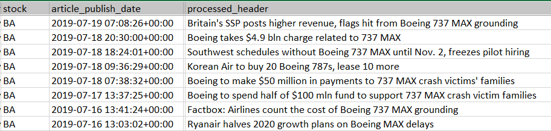
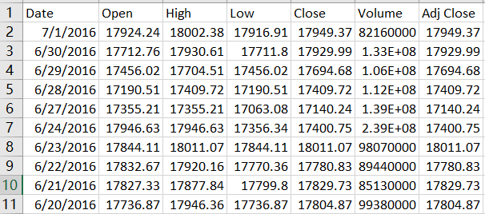
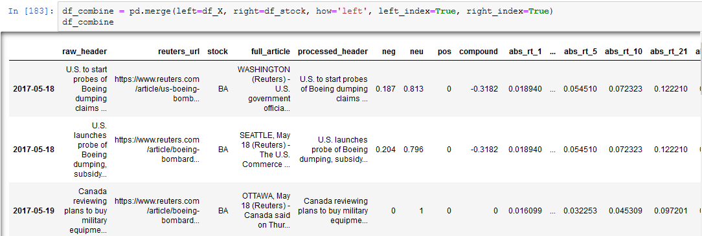
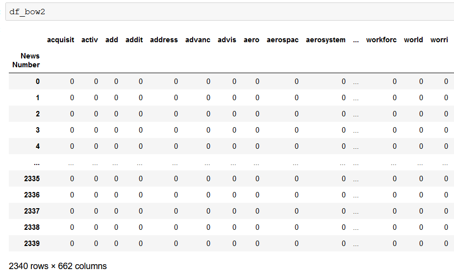
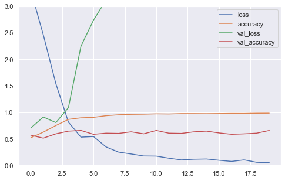
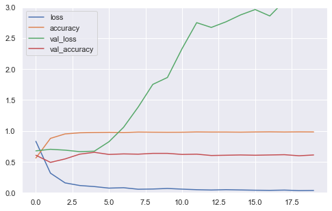
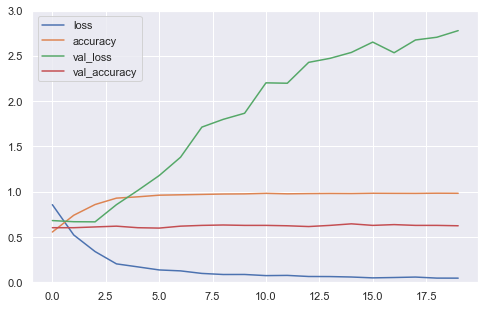
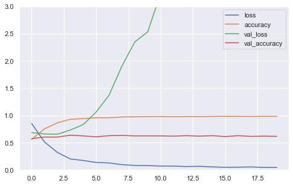

# Stock Price Movement Prediction Based on Daily News
 A Text Classification System with Multi-layer Perceptron and Naive Bayes Classifier

### author: Yi Rong

### date: 07/14/21
---

### Abstract

To predict the impact of daily news on the stock’s future price movement, a text
classification system is built to train models using two machine learning methods and
these models can make prediction in 6 different terms. The two machine learning
methods are multi-layer perceptron (MLP) and naive Bayes Classifier (NBC) and
both methods take daily news headlines as input and the price movements in the
corresponding periods as labels. The relative performance of the two machine learning
methods is tested through 4 stocks, which have the most amount of news in my
database, and compared with baseline. The baseline is the maximal proportion of
one of the two labels. Because of testing with 4 stocks and 6 labels, both models
will be tested in 24 situations. From the results of the 24 experiments, three findings
are obtained: (1) for both MLP and NBC, their accuracies are higher than baseline
and the accuracy performances for the 4 different stocks are similar and higher than
baseline, so the both models are proven to be generalized and useful; (2) MLP models
show higher average prediction accuracy than NBC for each stock, but it takes much
more time and computational resources to train the models; (3) both models can
predict better for middle terms (5-day, 10-day) compared with short terms (1-day,
3-day) and long terms (21-day, 63-day), this result may advice users to consider
making better use of the system’s middle-term predictions.

### 1.1 Background
The essential of stock price movement is the variation of investors’ expectation
on the public company. One of the most important driven factors that affects investor’s expectation is the public news. However, the amount of newly published
news is extremely huge for each day, so it is impossible for humans to digest all
of them by themselves. However, with the development of information techniques
and computer‘s computing power, some heavy duties like text classification can
be allocated partially to machine learning systems. Actually, many institutional
investors have already developed their own machine learning system to handle the
news stream. In this project, I also built a text classifier to predict the stock’s price
movement using Reuters’ financial news. Besides, the binary label of each news,
indicating price up or down, was generated by stock’s daily prices. Since news may
have short-term or long-term effect on the stock’s price, I specified 6 different terms
including 1-day, 3-day, 5-day, 10-day, 21-day and 63-day. With sufficient data, I
picked two machine learning methods to train models. The first one is MLP, whose
computation complexity is much higher and the other one is NBC, which is much
more efficient. After training models with these machine learning methods and
obtaining their performance results, the quality and the characteristics of the text
classifier can be known. Also, the comparison of the two machine learning methods
can be presented.

### 1.2 Data Description

#### (a) Reuters News

• Description

This dataset comes from a Kaggle project, named as Reuters Articles for
3500+ Stocks since 2017. The data belongs to Reuters, which is a business
and financial news provider. The dataset includes news title, related stock,
and its timestamp, which are important in this project.

• URI

https://www.kaggle.com/miguelaenlle/reuters-articles-for-3500-stocks-since-2017

• Features

stock: related stock ticker
article_publish_date: the time that the news was published in UTC+0
processed_header: simplified news headline

• Sample

#### (b) Stock Price

• Description

Stock price data can be downloaded through Python library, pandas_datareader,
to access data in yahoo finance. To use the library’s read function, three
parameters are required, which are stock ticker, start date and end date.

• URI

https://pandas-datareader.readthedocs.io/en/latest/

• Sample

### 2.1 Data Processing
Raw data of news and stock price percentage changes are loaded and matched for
each date. Here is an example of stock BA (Boeing Co) below. The index column at
left is the news published date. The processed_header column contains text data
which will be taken as input. The columns start with “abs” or “rl”, like abs_rt_1
or rl_rt_1, are the absolute or relative stock price percentage change in the next
few days. The absolute stock price percentage change is only calculated based on
the stock’s price, however, the relative change refers to the different between stock’s
percentage change and stock market index’s percentage change. In order to exclude
the impact of the market, this project uses relative stock’s price percentage change
only to generate binary labels.

In the next step, news data will be cleaned and stemmed and converted to bag of
words. Stock’s price change data will be converted to 1 or 0, which means positive
or negative price change, and used as prediction labels. The example below shows a
part of bag of words.

### 2.2 MLP: Hidden Layer Design
I design 3 hidden-layer patterns, which are 3 flat layers, 2 flat layers and 3 pyramid
layers. I am going to compare them and use the best one. For the number of nodes,
in one layer, there are usually 2048 nodes because the input attributes reach 2162
at most. For pyramid shape, I use 2048, 512, and 128 as the numbers of nodes.
Before training, The original dataset is randomly separated 80% to training, 10% to
validation, and 10% to test. The activation function is ReLU and SGD is used as
the optimizer. After finishing training , the learning curves of the 3 model designs
are obtained and shown below:

3-flat-layer

2-flat-layer 

3-pyramid

From the results above, it is obvious that the overfitting is a problem because the
train loss and validation loss diverge further and further instead of converging. In
order to reduce overfitting, the 3 pyramid layer should be the best one and it will be
used in the next step.

### 2.3 MLP: Activation Function
In the last step, the activation function is ReLU because it is popular. However,
it is not clear if it is the best activation function. Next, I compare ReLU with
ELU and Leaky ReLU. Actually, Tanh and Sigmod are popular as well, but they
are saturated and not suitable for regularization and they are easily suffering from
gradient vanishing, so they are not considered here. The learning curves for the three
activation functions are shown below:

Leaky ReLU shows further divergence again, so it will not be considered. Comparing ReLU and ELU, they are similar in divergence, but ReLU shows higher accuracy
(69.7%) than the accuracy of ELU (66.7%). Therefore, I will keep using ReLU.
