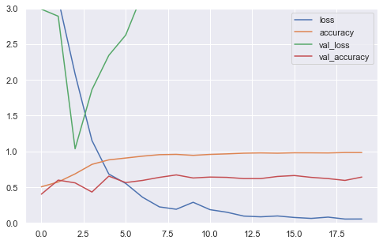
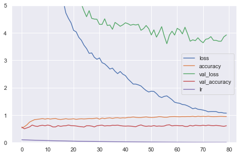

# Stock Price Movement Prediction Based on Daily News
 A Text Classification System with Multi-layer Perceptron and Naive Bayes Classifier

### author: Yi Rong

### date: 07/14/21
---

### Abstract

To predict the impact of daily news on the stock’s future price movement, a text
classification system is built to train models using two machine learning methods and
these models can make prediction in 6 different terms. The two machine learning
methods are multi-layer perceptron (MLP) and naive Bayes Classifier (NBC) and
both methods take daily news headlines as input and the price movements in the
corresponding periods as labels. The relative performance of the two machine learning
methods is tested through 4 stocks, which have the most amount of news in my
database, and compared with baseline. The baseline is the maximal proportion of
one of the two labels. Because of testing with 4 stocks and 6 labels, both models
will be tested in 24 situations. From the results of the 24 experiments, three findings
are obtained: (1) for both MLP and NBC, their accuracies are higher than baseline
and the accuracy performances for the 4 different stocks are similar and higher than
baseline, so the both models are proven to be generalized and useful; (2) MLP models
show higher average prediction accuracy than NBC for each stock, but it takes much
more time and computational resources to train the models; (3) both models can
predict better for middle terms (5-day, 10-day) compared with short terms (1-day,
3-day) and long terms (21-day, 63-day), this result may advice users to consider
making better use of the system’s middle-term predictions.

## Introduction

### 1.1 Background
The essential of stock price movement is the variation of investors’ expectation
on the public company. One of the most important driven factors that affects investor’s expectation is the public news. However, the amount of newly published
news is extremely huge for each day, so it is impossible for humans to digest all
of them by themselves. However, with the development of information techniques
and computer‘s computing power, some heavy duties like text classification can
be allocated partially to machine learning systems. Actually, many institutional
investors have already developed their own machine learning system to handle the
news stream. In this project, I also built a text classifier to predict the stock’s price
movement using Reuters’ financial news. Besides, the binary label of each news,
indicating price up or down, was generated by stock’s daily prices. Since news may
have short-term or long-term effect on the stock’s price, I specified 6 different terms
including 1-day, 3-day, 5-day, 10-day, 21-day and 63-day. With sufficient data, I
picked two machine learning methods to train models. The first one is MLP, whose
computation complexity is much higher and the other one is NBC, which is much
more efficient. After training models with these machine learning methods and
obtaining their performance results, the quality and the characteristics of the text
classifier can be known. Also, the comparison of the two machine learning methods
can be presented.

### 1.2 Data Description

#### (a) Reuters News

• Description

This dataset comes from a Kaggle project, named as Reuters Articles for
3500+ Stocks since 2017. The data belongs to Reuters, which is a business
and financial news provider. The dataset includes news title, related stock,
and its timestamp, which are important in this project.

• URI

https://www.kaggle.com/miguelaenlle/reuters-articles-for-3500-stocks-since-2017

• Features

stock: related stock ticker
article_publish_date: the time that the news was published in UTC+0
processed_header: simplified news headline

• Sample

#### (b) Stock Price

• Description

Stock price data can be downloaded through Python library, pandas_datareader,
to access data in yahoo finance. To use the library’s read function, three
parameters are required, which are stock ticker, start date and end date.

• URI

https://pandas-datareader.readthedocs.io/en/latest/

• Sample

## Machine Learning Model Design

### 2.1 Data Processing
Raw data of news and stock price percentage changes are loaded and matched for
each date. Here is an example of stock BA (Boeing Co) below. The index column at
left is the news published date. The processed_header column contains text data
which will be taken as input. The columns start with “abs” or “rl”, like abs_rt_1
or rl_rt_1, are the absolute or relative stock price percentage change in the next
few days. The absolute stock price percentage change is only calculated based on
the stock’s price, however, the relative change refers to the different between stock’s
percentage change and stock market index’s percentage change. In order to exclude
the impact of the market, this project uses relative stock’s price percentage change
only to generate binary labels.

In the next step, news data will be cleaned and stemmed and converted to bag of
words. Stock’s price change data will be converted to 1 or 0, which means positive
or negative price change, and used as prediction labels. The example below shows a
part of bag of words.

### 2.2 MLP: Hidden Layer Design
I design 3 hidden-layer patterns, which are 3 flat layers, 2 flat layers and 3 pyramid
layers. I am going to compare them and use the best one. For the number of nodes,
in one layer, there are usually 2048 nodes because the input attributes reach 2162
at most. For pyramid shape, I use 2048, 512, and 128 as the numbers of nodes.
Before training, The original dataset is randomly separated 80% to training, 10% to
validation, and 10% to test. The activation function is ReLU and SGD is used as
the optimizer. After finishing training , the learning curves of the 3 model designs
are obtained and shown below:

• 3-flat-layer

• 2-flat-layer 

• 3-pyramid

From the results above, it is obvious that the overfitting is a problem because the
train loss and validation loss diverge further and further instead of converging. In
order to reduce overfitting, the 3 pyramid layer should be the best one and it will be
used in the next step.

### 2.3 MLP: Activation Function
In the last step, the activation function is ReLU because it is popular. However,
it is not clear if it is the best activation function. Next, I compare ReLU with
ELU and Leaky ReLU. Actually, Tanh and Sigmod are popular as well, but they
are saturated and not suitable for regularization and they are easily suffering from
gradient vanishing, so they are not considered here. The learning curves for the three
activation functions are shown below:

• ReLU

• ELU

• Leaky_ReLU

Leaky ReLU shows further divergence again, so it will not be considered. Comparing ReLU and ELU, they are similar in divergence, but ReLU shows higher accuracy (69.7%) than the accuracy of ELU (66.7%). Therefore, I will keep using ReLU.

### 2.4 MLP: Regularization
To make the model generalized, I will test more regularization techniques to reduce overfitting. The most used techniques are L1 norm regularizer and L2 norm
regularizer. Since the regularizer will slow down the training, so more epoches are
used here. The learning curves for them can be found below:

• L1: 0.001

• L1: 0.0005

• L1: 0.0001

Another popular technique to reduce overfitting is drop out. So, my question is if
we should use it alone or with L1 norm. For drop out, it has a parameter named drop
out rate and it is 0.5 usually. To compare, I test both scenarios and their learning
curves are listed below:

• D: 0.5

• D: 0.5 + L1

There is one more technique to constrain weights, which is max norm. After adding
the max norm, the learning curve is shown below:

• L1: 0.0005 + D: 0.5 + MaxNorm

In conclusion, overfitting is reduced a lot compared with the original result. After
comparing different regularization techniques, those kept in the MLP are L1 norm:
0.0005, Drop out: 0.5, and Max Norm. Besides, the accuracy now is only 64.5%. The
previous results have higher accuracy because they are overfitting and the accuracies
are not real.

### 2.5 MLP: Model Conclusion

### 2.6 MLP: Learning Rate Scheduler
In order to approach the local minimal loss better, we need to use a learning rate
scheduler to lower the learning rate when the loss is getting lower. In this part,
three learning rate schedulers are tested, which are step decay, time based decay, and
exponential decay. To make them comparable, the decay rate should be 0.5 after 20
epoches. Their learning curves are posted below:

• Step Decay

• Time Base

• Exponential

These three figures are very similar, so I need to compare their accuracy and loss to determine the best one. Their accuracies are 66.7%, 66.7%, 65.4%, and step decay has less loss (3.24) than time base decay (3.46), so I will use step decay in the next steps.

### 2.7 MLP: Check Points and Early Stopping

Up till now, the training epoch is fixed as 80. However, it may not be the best one.
So, in order to find the best epoch automatically, I will use both check point to save
model when the model is improved and early stopping to stop training when model
is not improved any more. Since validation accuracy will reach its peak very early
and not improve, so the monitor for check point ant early stopping is validation loss.
The training result for this step is shown below:

The accuracy for the check point model is 65.4% and the loss is 3.68. These results
are similar to the previous results, so these two techniques should be kept.

### 2.8 NBC: Training
The second machine learning method in the text classification system is Naive
Bayes Classifier. Based on the calculation formulas, the first step is to compute the
probability of each word given positive label and then compute the probability of
each word given negative label. Besides, I need to know the probability of positive
and negative labels. With these results, we can make prediction for a new data and
obtain two probabilities for positive and negative labels. The bigger label should be
assigned to the new data. The example below shows the positive label probability of
each word for predicting BA in 1-day:

• Positive Label Probability of Each Word

And another example shows the negative label probability of each word for predicting BA in 1-day:

• Negative Label Probability of Each Word

## Performance Evaluation

### 3.1 Baseline Performance

The baseline in this project should be the maximal proportion of one of the two
labels. For example, if AAPL’s 1-day labels include 60.0% positive labels and 40.0%
negative labels, the base line should be 60.0%. Otherwise, it will be easy to reach
60.0% accuracy if all predictions are positive. Based on this rule, the baseline results
are shown below:

• Baseline Accuracy

### 3.2 MLP Performance

The MLP model was only trained by one dataset and one label set. In the dataset,
there are 4 stocks and 6 labels, so there should be 24 different weights in total. We
need to use the same model to train with all of the datasets and evaluate if the model
is generalized. The measurement used here is the accuracy for test set and comparing
it with baseline. After training each dataset, the model is saved by check point and
its learning curve and accuracy are stored in local. Compared with baseline, all the
accuracy differences are shown in the chart below:

• MLP Accuracy over Baseline

• MLP Average Accuracy for Each Stock

Moreover, if we take a look at the the average accuracy for different terms over
baseline, we can find a curve opening downwards. It means, with the term extending,
the prediction accuracy is increasing and then decreasing, which matches my expectation. Usually, it is hard for machine learning to predict very short term (1-day,
3-day) or very long term (21-day, 63-day). The middle terms (5-day, 10-day) are
easier to predict. The term accuracy details is posted below:

• MLP Term Accuracy over Baseline

### 3.3 NBC Performance
I also use NBC 24 times to obtain results for each dataset. The chart below shows
NBC’s accuracy performance over baseline.

• NBC Accuracy over Baseline

• NBC Average Accuracy for Each Stock

Since NBC is also trained based on each word, so its performance is similar to
MLP’s performance. If we take a look at the the average accuracy for different terms
over baseline again, we can also find a curve opening downwards. The the middle
term effect also exists for NBC. The term accuracy details is shown below:

• NBC Term Accuracy over Baseline

### 3.4 Comparison: MLP vs NBC
Both methods can improve the text classification performance and it is clear that
MLP is better than NBC based on the accuracy. The comparison detail for each
stock can be found in the table below:

• Performance Comparison: MLP vs NBC

Although MLP is better in accuracy, it takes much more time to train models and
consumes huge computational resources to optimize models. In the production, MLP
takes around 10 minutes to train one stock with one label. However, NBC only takes
less than 1 second to train the model. So, NBC will be preferred when the accuracy
requirement is not so high, computational resources are limited, and time-efficiency
is highly required.

## Usability Test
Since I already obtained all the models from MLP, this text classification system
can use MLP as machine learning kernel. Then, when the system receives new data
and the related stock, it can make prediction for 6 terms. I am going to test the
system’s usability with 4 new data about Deutsche Bank (DB). The figure below
shows the prediction details:

With the results above, the users can make investment decision based on different
investment terms. And if the system is used for screening all the stocks, it will be a
very useful to filter stocks.

## Conclusion
A text classification system is built to predict the stock’s future price movements
in 6 terms. The two machine learning methods, MLP and NBC, are both preforming
well in the system. For both MLP and NBC, the accuracy and generalism are tested
through 4 stocks and the prediction performances for the 4 stocks are similar and
higher than baseline, so the both models are proven to be generalized and useful.
Compared with NBC’s relative accuracy (9.6%), the average accuracy for MLP is
higher (11.8%). Also, MLP models show higher average accuracy than NBC for each
stock, but it takes much more time and computational resources to train the models.
Besides, both models can predict better for middle terms (5-day, 10-day) compared
with short terms (1-day, 3-day) and long terms (21-day, 63-day), this result may
advice users to consider making better use of the system’s middle-term predictions.